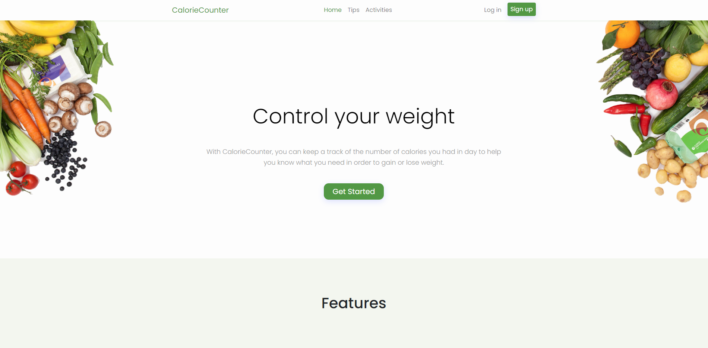
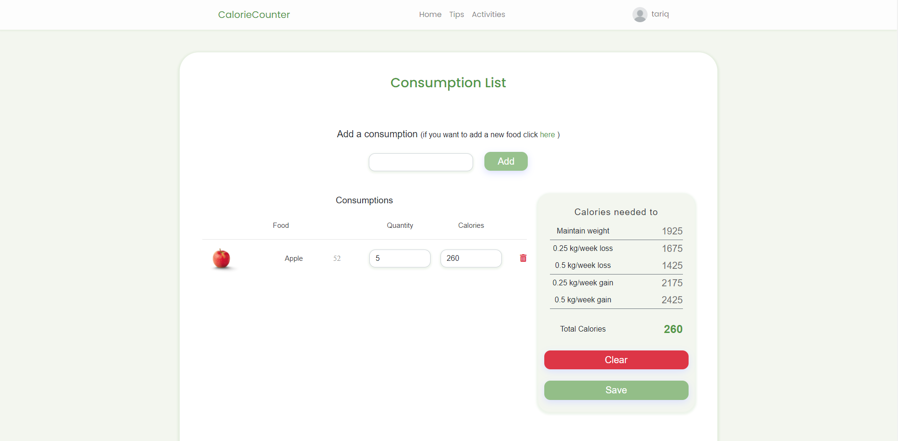

# CalorieCounter

## Description

CalorieCounter is a MERN stack application that can help you manage the number of calories you take a day in order to maintain a healthier diet (The project is still in progress so more features will be added in the future).

## Technologies used

React - Redux - Express - MongoDB - Bootstrap 5 - Sass

<div></div>

<div></div>

**Live preview:** [CalorieCounter](https://g-calorie-counter.herokuapp.com/)

## Installing dependencies

This postinstall script (which would install both dependencies for the backend and frontend) for this project uses yarn, so you should install yarn globally first if you don't have it already.

```sh
npm i -g yarn
```

Then you can simply install the dependencies using the command "yarn" in the root folder

```sh
yarn
```

## Usage

Before you run the project, make sure to create a config.env file in the path "src/config/config.env" (Or you can just copy the sample file in the config folder and rename it to config.env)

This is an example how the config file should look

```.env
NODE_ENV=development
PORT=5000

# BASE_URL is the URL of your host
BASE_URL=
JWT_SECRET=
MONGO_URI=
```

You should also change the default url for axios on the frontend to your url. Axios settings can be found on `client/src/App.js`

```jsx
axios.defaults.baseURL = 'https://g-calorie-counter.herokuapp.com/rest';
```
